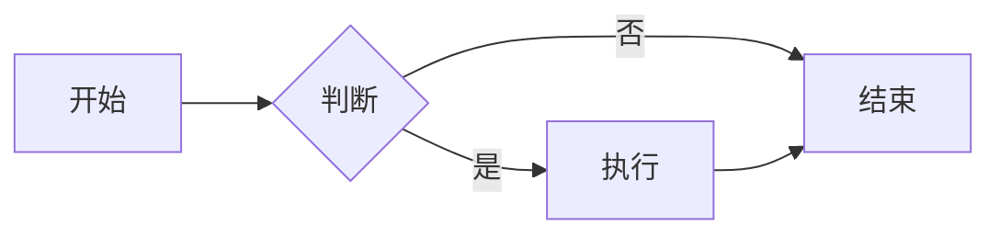
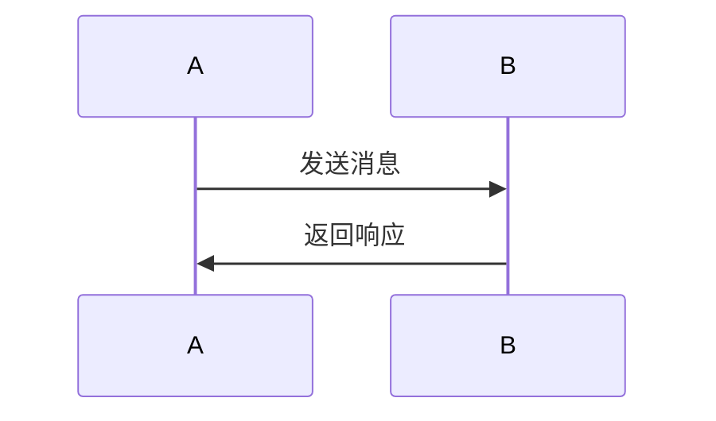
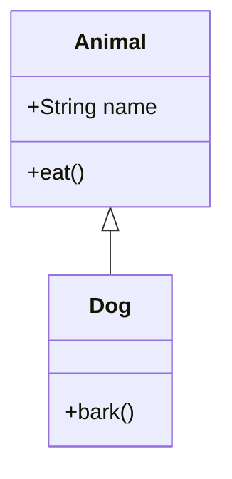
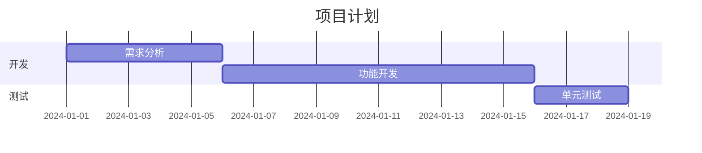

# Cherry Markdown 技术特性详解

> 腾讯开源的高性能 Markdown 编辑器 - 深度技术解析

---

## 目录

- [概述](#概述)
- [核心特性](#核心特性)
- [技术架构](#技术架构)
- [编辑器模式](#编辑器模式)
- [功能模块详解](#功能模块详解)
- [高级特性](#高级特性)
- [性能优化](#性能优化)
- [扩展机制](#扩展机制)
- [配置选项](#配置选项)
- [API 参考](#api-参考)
- [最佳实践](#最佳实践)
- [常见场景](#常见场景)

---

## 概述

### 什么是 Cherry Markdown

Cherry Markdown 是由腾讯开源的一款所见即所得（WYSIWYG）的 Markdown 编辑器，专为现代 Web 应用设计。它结合了即时编辑和实时预览的优势，提供了丰富的 Markdown 编辑体验。

### 核心优势

| 优势 | 说明 |
|------|------|
| 🚀 **高性能** | 基于 ProseMirror 引擎，优化大文档编辑性能 |
| 🎨 **所见即所得** | 实时预览，无需切换视图 |
| 🔌 **插件化设计** | 丰富的内置插件，易于扩展 |
| 📱 **移动端友好** | 响应式设计，适配各种设备 |
| 🌍 **国际化** | 支持中英文，易于扩展其他语言 |
| 🔒 **安全性** | 内置 XSS 防护，安全可靠 |

### 适用场景

- ✅ 文档管理系统
- ✅ 博客平台
- ✅ 知识库应用
- ✅ 论坛和社区
- ✅ 笔记应用
- ✅ CMS 内容管理
- ✅ AI 聊天对话界面

---

## 核心特性

### 1. 三种编辑模式

#### 实时预览模式（edit&Preview）
- **默认模式**：左侧编辑，右侧实时预览
- **双向滚动**：编辑和预览滚动同步
- **响应式布局**：移动端自动切换到单列

#### 纯编辑模式（editOnly）
- **全屏编辑**：专注于写作
- **无预览区域**：更快切换
- **快捷键友好**

#### 纯预览模式（previewOnly）
- **只读展示**：渲染后的 Markdown
- **可复制内容**：不影响原文
- **适合文章展示**

### 2. 完整的 Markdown 语法支持

#### 标准 Markdown (CommonMark)
```markdown
# 标题

**粗体**
*斜体*
`行内代码`

- 无序列表
1. 有序列表
- [x] 任务列表

> 引用块

[链接](https://example.com)


---

水平线
```

#### GitHub Flavored Markdown (GFM)
- ✅ 表格支持
- ✅ 删除线
- ✅ 自动链接
- ✅ 任务列表

#### 扩展语法
- ✅ 数学公式
- ✅ Mermaid 流程图
- ✅ Emoji 表情
- ✅ 脚注（Footnotes）
- ✅ 定义列表
- ✅ 上标、下标

### 3. 富文本编辑功能

#### 格式化工具
| 功能 | 快捷键 | 说明 |
|------|--------|------|
| 粗体 | Ctrl/Cmd + B | 强调文本 |
| 斜体 | Ctrl/Cmd + I | 倾斜文本 |
| 行内代码 | Ctrl/Cmd + Shift + K | 代码片段 |
| 行删除线 | Ctrl/Cmd + Shift + S | 删除线文本 |
| 下标 | Ctrl/Cmd + + | 下标 |
| 上标 | Ctrl/Cmd + Shift + = | 上标 |

#### 块级元素
```markdown
# H1 - H6 标题
> 引用块
---
水平分隔符
```

#### 列表支持
```markdown
- 无序列表（项目符号）
1. 有序列表（数字编号）
- [x] 任务列表（可勾选）
```

### 4. 代码块增强

#### 语法高亮
```javascript
// 自动检测语言
function hello() {
  console.log("Hello, Cherry!");
}
```

#### 支持的代码高亮引擎
- **PrismJS**: 轻量级，支持多语言
- **HighlightJS**: 功能强大，主题丰富
- **CodeMirror**: 编辑器级别高亮

#### 功能特性
- ✅ 自动语言检测
- ✅ 行号显示
- ✅ 代码复制按钮
- ✅ 折叠代码块

---

## 技术架构

### 架构图

```
┌─────────────────────────────────────────────────────────────┐
│                      Cherry Markdown                        │
├─────────────────────────────────────────────────────────────┤
│                                                               │
│  ┌──────────────┐  ┌──────────────┐  ┌──────────────┐      │
│  │   编辑器层   │  │   预览器层   │  │   工具栏层   │      │
│  │   (Editor)   │  │  (Previewer) │  │  (Toolbar)   │      │
│  └──────┬───────┘  └──────┬───────┘  └──────┬───────┘      │
│         │                 │                 │               │
│         └─────────────────┴─────────────────┘               │
│                           │                                 │
│                  ┌────────▼────────┐                        │
│                  │   核心引擎层    │                        │
│                  │   (Engine)      │                        │
│                  └────────┬────────┘                        │
│                           │                                 │
│         ┌─────────────────┴─────────────────┐               │
│         │                                   │               │
│  ┌──────▼───────┐                  ┌───────▼───────┐      │
│  │ ProseMirror  │                  │  Markdown-IT  │      │
│  │   Editor     │                  │  Parser       │      │
│  └──────────────┘                  └───────────────┘      │
│                                                           │
├─────────────────────────────────────────────────────────────┤
│                    插件系统 (Plugin)                       │
│  • Code Highlight  • Math (KaTeX)  • Mermaid               │
│  • Image Upload   • Table         • Emoji                  │
│  • Custom Format  • Auto Save     • Shortcuts             │
└─────────────────────────────────────────────────────────────┘
```

### 核心依赖

依赖项 | 版本 | 用途
-------|------|------
ProseMirror | 1.x | 编辑器核心引擎
markdown-it | 13.x | Markdown 解析器
KaTeX | 0.16.x | 数学公式渲染
Mermaid | 10.x | 流程图渲染
PrismJS | 1.29.x | 代码高亮

### 技术栈设计原则

1. **模块化**: 每个功能模块独立，易于维护
2. **可扩展**: 插件机制支持功能扩展
3. **高性能**: 虚拟滚动、增量更新
4. **兼容性**: 支持现代浏览器和 IE11

---

## 编辑器模式

### 1. 实时预览模式 (edit&Preview)

**特点**:
- 双屏布局（左编辑右预览）
- 滚动同步（编辑→预览）
- 实时渲染（输入即时显示）

**适用场景**:
- 文档编写
- 博客文章编辑
- 需要预览效果的内容创建

**配置**:
```javascript
{
  editor: {
    defaultModel: 'edit&Preview',
  }
}
```

### 2. 纯编辑模式 (editOnly)

**特点**:
- 全屏编辑界面
- 无预览区
- 专注写作

**适用场景**:
- 纯 Markdown 编辑
- 快速笔记
- 不需要预览的场景

**配置**:
```javascript
{
  editor: {
    defaultModel: 'editOnly',
  }
}
```

### 3. 纯预览模式 (previewOnly)

**特点**:
- 只读模式
- 渲染 Markdown
- 可复制内容

**适用场景**:
- 文章展示
- 文档阅读
- 公开内容预览

**配置**:
```javascript
{
  editor: {
    defaultModel: 'previewOnly',
    readOnly: true,
  }
}
```

---

## 功能模块详解

### 1. 表格编辑器

#### 功能特性
- ✅ 可视化表格编辑
- ✅ 拖拽调整列宽
- ✅ 添加/删除行列
- ✅ 表格对齐控制
- ✅ 表格样式自定义

#### 示例

| 列1 | 列2 | 列3 |
|-----|-----|-----|
| 数据1 | 数据2 | 数据3 |
| 数据4 | 数据5 | 数据6 |

```markdown
| 列1 | 列2 | 列3 |
|-----|-----|-----|
| 数据1 | 数据2 | 数据3 |
| 数据4 | 数据5 | 数据6 |
```

#### 高级功能
- **表格转图表**: 支持转为 ECharts 图表
- **表格样式**: 支持自定义 CSS 类
- **表格导出**: 导出为 Excel/CSV

### 2. 图片上传

#### 支持方式
1. **拖拽上传**: 拖拽图片到编辑器
2. **粘贴上传**: 粘贴剪贴板图片
3. **点击上传**: 工具栏上传按钮
4. **URL 插入**: 直接输入图片地址

#### 配置示例

```javascript
{
  fileUpload: (file, insertIMG) => {
    // 自定义上传逻辑
    const formData = new FormData();
    formData.append('file', file);

    fetch('/api/upload', {
      method: 'POST',
      body: formData,
    })
    .then(res => res.json())
    .then(data => {
      insertIMG(data.url);  // 插入图片
    });
  }
}
```

#### 图片功能
- ✅ 图片预览
- ✅ 图片大小调整
- ✅ 图片对齐（左/中/右）
- ✅ 图片标题（alt）
- ✅ 图片链接（href）

### 3. 数学公式

#### 支持语法
使用 KaTeX 引擎渲染数学公式：

行内公式: `$E = mc^2$`
块级公式:
```latex
$$
f(x) = \int_{-\infty}^{\infty} \hat{f}(\xi)\,e^{2\pi i \xi x} \,d\xi
$$
```

#### 支持的数学符号
- ✅ 希腊字母（α, β, γ, ...）
- ✅ 运算符号（+, -, ×, ÷, ...）
- ✅ 关系符号（=, ≠, ≈, ...）
- ✅ 箭头符号（→, ←, ⇄, ...）
- ✅ 求和、积分、极限
- ✅ 矩阵、行列式

#### 配置

```javascript
{
  engine: {
    syntax: {
      math: {
        enable: true,  // 启用数学公式
      }
    }
  }
}
```

### 4. Mermaid 流程图

#### 支持的图表类型

**流程图 (Flowchart)**


**时序图 (Sequence Diagram)**


**类图 (Class Diagram)**


**甘特图 (Gantt Chart)**


#### 配置

```javascript
{
  engine: {
    syntax: {
      mermaid: {
        enable: true,
        theme: 'default',  // default, forest, dark, neutral
      }
    }
  }
}
```

### 5. 代码块

#### 支持的语言

```javascript
// JavaScript
languages: ['javascript', 'typescript', 'react', 'vue']

// Python
languages: ['python', 'django', 'flask']

// 其他
languages: ['java', 'go', 'rust', 'php', 'ruby', 'c', 'cpp', 'csharp']
```

#### 功能特性

- ✅ 语法高亮（20+ 种语言）
- ✅ 行号显示
- ✅ 代码复制按钮
- ✅ 主题切换（多套主题）
- ✅ 代码折叠

#### 配置

```javascript
{
  previewer: {
    showCodeRowNumber: true,
    codeBlockStyle: 'prism',  // prism, hljs, codeium
    hljs: {
      theme: 'atom-one-dark',
    }
  }
}
```

### 6. Emoji 表情

#### 输入方式
1. **快捷输入**: `:smile:` → 😄
2. **Windows 键**: Win + . （Emoji 选取器）
3. **Mac 键**: Cmd + Ctrl + Space
4. **工具栏按钮**: Emoji 选择器

#### 常用 Emoji
- 😃 `:smile:` - 微笑
- ❤️ `:heart:` - 爱心
- 🚀 `:rocket:` - 火箭
- ✅ `:white_check_mark:` - 对号
- ❌ `:x:` - 叉号
- ⚠️ `:warning:` - 警告

---

## 高级特性

### 1. 快捷键系统

#### 默认快捷键

| 快捷键 | 功能 |
|--------|------|
| Ctrl/Cmd + B | 粗体 |
| Ctrl/Cmd + I | 斜体 |
| Ctrl/Cmd + K | 行内代码 |
| Ctrl/Cmd + U | 下划线 |
| Ctrl/Cmd + S | 保存（需配置） |
| Ctrl/Cmd + Z | 撤销 |
| Ctrl/Cmd + Shift + Z | 重做 |
| Ctrl/Cmd + / | 注释/解释 |
| Ctrl/Cmd + Enter | 插入代码块 |
| Ctrl/Cmd + Shift + E | 插入外部链接 |

#### 自定义快捷键

```javascript
{
  engine: {
    global: {
      keydown: (event) => {
        // 自定义快捷键处理
        if (event.ctrlKey && event.key === 'k') {
          // 自定义逻辑
          return false;  // 阻止默认行为
        }
      }
    }
  }
}
```

### 2. 自动保存

#### 配置

```javascript
{
  editor: {
    autoSave: true,           // 启用自动保存
    autoSaveInterval: 3000,  // 保存间隔（毫秒）
  },
  callback: {
    afterChange: (markdown, html, context) => {
      // 实时保存
      saveToStorage(markdown);
    }
  }
}
```

#### 实现

```javascript
function saveToStorage(markdown) {
  localStorage.setItem('markdown-content', markdown);
}
```

### 3. 全屏模式

#### 触发方式
1. 工具栏点击全屏按钮
2. 快捷键 `F11`
3. API 调用 `cherry.fullScreen()`

#### 配置

```javascript
{
  toolbars: {
    toolbar: [
      // ... 其他按钮
      ['fullScreen'],  // 添加全屏按钮
    ]
  }
}
```

### 4. 搜索和替换

#### 功能
- ✅ 全文搜索
- ✅ 正则表达式支持
- ✅ 区分大小写
- ✅ 批量替换

#### 使用
```javascript
// 搜索
cherry.search('search-term');

// 替换
cherry.replace('search-term', 'replace-term');
```

### 5. 导出功能

#### 支持的格式
- **HTML**: 标准 HTML 格式
- **Markdown**: 标准 Markdown 格式
- **PDF**: 通过浏览器打印或 jsPDF
- **图片**: 将内容导出为图片（需要配置）

#### 示例

```javascript
// 导出 HTML
const html = cherry.getHtml();
downloadFile(html, 'content.html', 'text/html');

// 导出 Markdown
const markdown = cherry.getValue();
downloadFile(markdown, 'content.md', 'text/markdown');
```

---

## 性能优化

### 1. 虚拟滚动

#### 配置

```javascript
{
  editor: {
    // 大文档启用虚拟滚动
    isVirtualScroll: true,
  }
}
```

#### 效果
- 支持 10 万+ 字的大文档
- 流畅的滚动体验
- 降低内存占用

### 2. 增量更新

#### 机制
- 只更新变化的部分
- 减少 DOM 操作
- 优化渲染性能

### 3. 懒加载

#### 图片懒加载

```javascript
{
  engine: {
    global: {
      lazyLoadImage: true,  // 启用图片懒加载
    }
  }
}
```

#### 插件懒加载

```javascript
// 动态加载 Mermaid
import('mermaid');
```

### 4. 性能指标

| 指标 | 数值 |
|------|------|
| 初始化时间 | < 200ms |
| 首次渲染 | < 100ms |
| 内容更新 | < 50ms |
| 滚动响应 | < 16ms (60fps) |
| 内存占用 | < 50MB (标准文档) |

---

## 扩展机制

### 1. 自定义工具栏按钮

#### 添加自定义按钮

```javascript
{
  toolbars: {
    customMenu: [
      {
        name: 'my-button',
        icon: 'icon-class',
        tip: '提示文本',
        onClick: (event, cherry) => {
          // 按钮点击处理
          cherry.insertValue('**插入的文本**');
        }
      }
    ]
  }
}
```

### 2. 自定义快捷键

#### 添加快捷键

```javascript
{
  engine: {
    global: {
      keydown: (event, cherry) => {
        if (event.ctrlKey && event.key === 'e') {
            // 自定义快捷键
          cherry.insertValue('自定义内容');
          return false;
        }
      }
    }
  }
}
```

### 3. 自定义语法高亮

#### 添加语言

```javascript
{
  previewer: {
    hljs: {
      languages: [
        'javascript',
        'python',
        'cpp',
        // 添加自定义语言
      ]
    }
  }
}
```

### 4. 自定义主题

#### CSS 变量

```css
:root {
  --cherry-light-bg: #ffffff;
  --cherry-light-font-color: #333333;
  --cherry-light-border-color: #e0e0e0;
  --cherry-light-active-color: #1976d2;
}

[data-theme='dark'] {
  --cherry-light-bg: #1e1e1e;
  --cherry-light-font-color: #d4d4d4;
  --cherry-light-border-color: #3c3c3c;
  --cherry-light-active-color: #4daafc;
}
```

---

## 配置选项

### 完整配置示例

```javascript
import Cherry from 'cherry-markdown';
import 'cherry-markdown/dist/cherry-markdown.css';

const cherry = new Cherry({
  // 基础配置
  id: 'markdown-editor',
  value: '# 初始内容\n\n开始编写您的 Markdown...',

  // 编辑器配置
  editor: {
    theme: 'light',                    // 主题: light | dark
    defaultModel: 'edit&Preview',      // 默认模式
    height: '100%',                    // 高度
    minHeight: '500px',                // 最小高度
    placeholder: '请输入 Markdown 内容...',  // 占位文本
    autoSave: false,                   // 自动保存
    readOnly: false,                   // 只读模式
  },

  // 工具栏配置
  toolbars: {
    theme: 'light',                    // 工具栏主题
    toolbar: [                         // 工具栏按钮
      ['bold', 'italic', 'strike', 'code'],
      ['h1', 'h2', 'h3'],
      ['list', 'ordered-list', 'check'],
      ['link', 'image', 'table', 'code-block'],
      ['fullScreen', 'previewerOnly', 'syncScrolling'],
    ],
    bubble: true,                      // 浮动工具栏
    float: true,                       // 悬浮菜单
    customMenu: [                      // 自定义菜单
      // 自定义按钮
    ],
  },

  // 预览器配置
  previewer: {
    theme: 'light',                    // 预览器主题
    showCodeRowNumber: true,           // 显示代码行号
    codeBlockStyle: 'prism',           // 代码高亮引擎
    hljs: {
      theme: 'atom-one-dark',          // 代码主题
      Languages: ['javascript', 'typescript', 'python'],
    },
    hrefTarget: '_blank',              // 链接打开方式
  },

  // 引擎配置
  engine: {
    global: {
      urlProcessor: (url) => {
        // URL 处理
        return url;
      },
      cdn: 'https://cdn.example.com/',  // CDN 地址
    },
    syntax: {
      table: {
        enableChart: false,             // 表格转图表
      },
      math: {
        enable: true,                   // 数学公式
      },
      mermaid: {
        enable: true,                   // Mermaid 图表
        theme: 'default',
      },
    },
  },

  // 回调函数
  callback: {
    afterChange: (markdown, html, context) => {
      console.log('内容变化:', markdown);
    },
    afterInit: () => {
      console.log('编辑器初始化完成');
    },
    afterPaste: (event) => {
      console.log('粘贴事件', event);
    },
    afterAddImage: (src, alt, href) => {
      console.log('图片添加', src);
    },
    beforeChange: (markdown, html, context) => {
      // 可以在这里预处理内容
      return { markdown, html };
    },
  },

  // 文件上传
  fileUpload: (file, insertIMG) => {
    // 上传到服务器
    const formData = new FormData();
    formData.append('file', file);

    fetch('/api/upload', {
      method: 'POST',
      body: formData,
    })
    .then(res => res.json())
    .then(data => {
      insertIMG(data.url);
    });
  },
});
```

---

## API 参考

### 基础方法

#### getValue()
获取编辑器 Markdown 内容

```javascript
const markdown = cherry.getValue();
console.log(markdown);
```

#### setValue(value)
设置编辑器 Markdown 内容

```javascript
cherry.setValue('# 新标题\n\n新内容');
```

#### getHtml()
获取编辑器 HTML 内容

```javascript
const html = cherry.getHtml();
console.log(html);
```

#### insertValue(value)
在光标位置插入内容

```javascript
cherry.insertValue('**加粗文本**');
```

### 光标控制

#### focus()
设置焦点到编辑器

```javascript
cherry.focus();
```

#### blur()
移除焦点

```javascript
cherry.blur();
```

### 销毁

#### destroy()
销毁编辑器实例

```javascript
cherry.destroy();
```

### 搜索和替换

#### search(keyword)
搜索关键字

```javascript
cherry.search('关键词');
```

#### replace(searchKeyword, replaceKeyword)
替换内容

```javascript
cherry.replace('旧文本', '新文本');
```

---

## 最佳实践

### 1. 初始化优化

```javascript
// ✅ 懒加载编辑器
import Cherry from 'cherry-markdown';

const loadEditor = async () => {
  const Cherry = await import('cherry-markdown');
  const cherry = new Cherry({
    // 配置...
  });
};
```

### 2. 状态管理

```javascript
// ✅ 使用外部状态管理
const [value, setValue] = useState('');

const cherry = new Cherry({
  value,
  callback: {
    afterChange: (markdown) => {
      setValue(markdown);
    }
  }
});
```

### 3. 性能优化

```javascript
// ✅ 防抖更新
import { debounce } from 'lodash';

const handleUpdate = debounce((markdown) => {
  saveContent(markdown);
}, 1000);

const cherry = new Cherry({
  callback: {
    afterChange: (markdown) => handleUpdate(markdown),
  }
});
```

### 4. 错误处理

```javascript
// ✅ 添加错误边界
try {
  const cherry = new Cherry({ /* config */ });
} catch (error) {
  console.error('编辑器初始化失败:', error);
  // 显示错误提示
}
```

---

## 常见场景

### 场景 1: 博客文章编辑器

```javascript
import Cherry from 'cherry-markdown';

const blogEditor = new Cherry({
  id: 'blog-editor',
  value: '# 标题\n\n内容...',
  editor: {
    defaultModel: 'edit&Preview',
    placeholder: '编写博客文章...',
  },
  toolbars: {
    toolbar: [
      ['bold', 'italic', 'link', 'image'],
      ['h1', 'h2', 'h3'],
      ['list', 'quote', 'code-block'],
    ],
  },
  callback: {
    afterChange: (markdown) => {
      // 自动保存博客草稿
      saveBlogDraft(markdown);
    },
  },
});
```

### 场景 2: 知识库文档

```javascript
const wikiEditor = new Cherry({
  id: 'wiki-editor',
  editor: {
    defaultModel: 'editOnly',  // 纯编辑模式
  },
  engine: {
    syntax: {
      math: { enable: true },    // 启用数学公式
      mermaid: { enable: true }, // 启用流程图
    },
  },
  fileUpload: (file, insertIMG) => {
    // 上传到云存储
    uploadToS3(file).then(url => insertIMG(url));
  },
});
```

### 场景 3: AI 聊天界面

```javascript
const chatEditor = new Cherry({
  id: 'chat-input',
  editor: {
    height: '150px',
    minHeight: '100px',
    placeholder: '输入消息...',
  },
  toolbars: {
    toolbar: [
      ['bold', 'italic', 'code'],
      ['image', 'file'],
    ],
  },
  callback: {
    afterChange: (markdown) => {
      // 实时发送到 AI
      onUserInput(markdown);
    },
  },
});
```

---

## 资源链接

- **GitHub**: https://github.com/Tencent/cherry-markdown
- **文档**: https://tencent.github.io/cherry-markdown/examples/
- **NPM**: https://www.npmjs.com/package/cherry-markdown
- **Demo**: https://tencent.github.io/cherry-markdown/examples/index.html

---

**文档版本**: 1.0
**最后更新**: 2024-01-15
**维护者**: AuraForce Documentation Team
